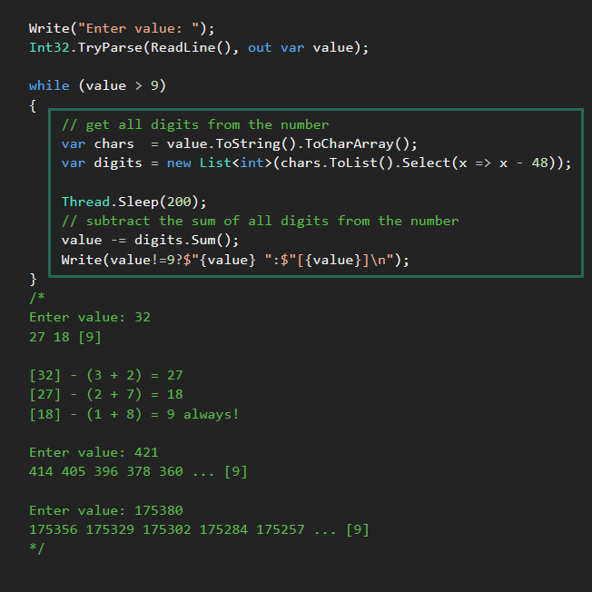
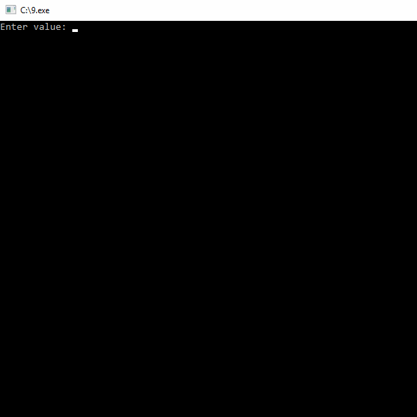

## "9"

[42]

42 - (4 + 2) = 36

36 - (3 + 6) = 27

27 - (2 + 7) = 18

18 - (1 + 8) = всегда получится 9

В десятеричной позиционной системе 42 это не 4 и 2, а десять 4 и одна 2.
Поэтому, убрав по одному позиционному разряду каждой группы из числа
остаётся уже не десять 4 и одна 2, а девять 4 без 2.
________________________________________________________________________
## Пример:

