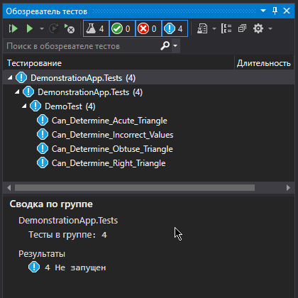

## TriangleLib

> **Треугольник** — геометрическая фигура, образованная тремя отрезками, которые соединяют три точки, не лежащие на одной прямой.

Типы треугольников: ```прямоугольный```, ```тупоугольный``` и ```остроугольный```.
___

### Задание

На языке **C#** написать библиотеку, содержащую единственный метод.  
Этот метод должен ==по трём сторонам определить тип треугольника: прямоугольный, тупоугольный или остроугольный==.

### Решение

```c#
using System;
using System.Linq;

namespace TriangleLib
{
    public struct Triangle
    {
        public static Boolean GetTriangleType(double a, double b, double c, out TriangleType? t)
        {
            var sides = (from x in new[] { a, b, c } orderby x descending select x).ToArray();
            var maxSide = sides[0];
            var midSide = sides[1];
            var minSide = sides[2];
            t = null;

            // C<a+b
            if (!(maxSide < minSide + midSide)) return false;

            var cPow = maxSide * maxSide;
            var bPow = midSide * midSide;
            var aPow = minSide * minSide;

            // C²<a²+b² остроугольный
            if (cPow < aPow + bPow) t = TriangleType.Acute;
            // C²>a²+b² тупоугольный
            else if (cPow > aPow + bPow) t = TriangleType.Obtuse;
            // C²=a²+b² прямоугольный
            else t = TriangleType.Right;

            return true;
        }
        public enum TriangleType : byte
        {
            Acute,  // остроугольный треугольник
            Obtuse, // тупоугольный треугольник
            Right   // прямоугольный треугольник
        }
    }
}
```

### Демонстрация



___

###### *решение подготовил Александр Усов*
